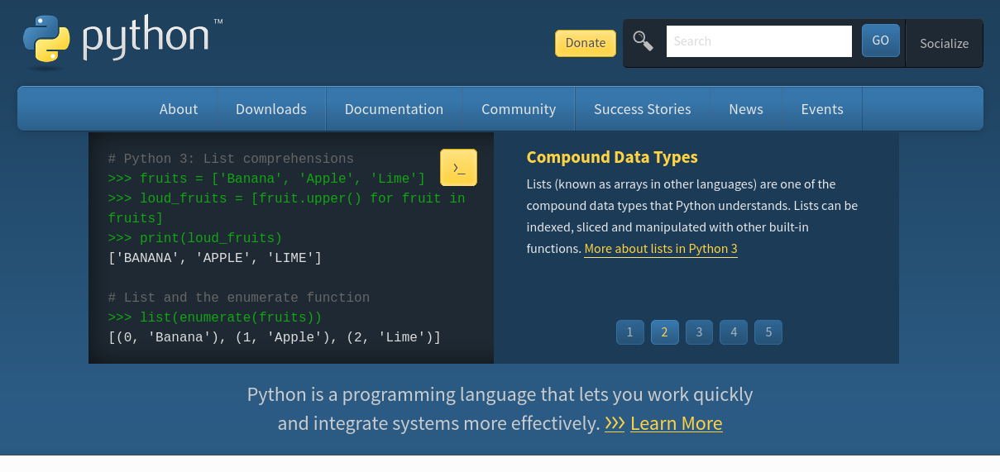

How To Contribute
=================

This site is build with Sphinx ( https://www.sphinx-doc.org/en/master/index.html ) and ReStructured Text

You can contribute in several ways!

* Ask! If you post a message asking for something to be added / changed / removed, just post a message in the Sierra ILS Slack, and someone will help!
* Do it yourself!

Modifying / Adding to the ils-undergound-docs Site
--------------------------------------------------

If you're interested in the DIY-route, here's a rough set of steps you can use:

1) Sync the ``ils-underground-docs`` repo, move into the ils-underground-docs directory, `and then` clone ``ils-undergound.github.io`` repo to the build/html target

   .. code-block:: bash
   
       git clone git@github.com:ils-underground/ils-underground-docs.git
       # NOTE: you may want to add this instead if you're not using ssh (but you should just use ssh if you can):
       # https://github.com/ils-underground/ils-underground-docs.git
       # Cloning into 'ils-underground-docs'...

       cd ils-underground-docs
       
       git clone --depth 1 git@github.com:ils-underground/ils-underground.github.io.git build/html
       # NOTE: you may want to add this instead if you're not using ssh (but you should just use ssh if you can):
       # https://github.com/ils-underground/ils-underground.github.io.git build/html
       # Cloning into 'build/html'...    

2) Create the python environment (using ``venv``) for the build software (Sphinx)

   .. code-block:: bash

      python3 -m venv venv

3) Activate the virtual environment and install the required python modules and software
   
   .. code-block:: bash

      source venv/bin/activate
      # you should have (venv) before your prompt now
      pip install -U pip
      # ...
      pip install -r requirements.txt

4) Make any changes or add additional files to the site (just as an example, write some test text to add a test page)

   .. code-block:: bash

      # this is purely here just for a simple example ... 
      echo $'TEST\n====' > source/test.rst

5) run the script to create the static files (this will create the ``build`` directory, which should now contain the static site in the ``html`` directory)

   .. code-block:: bash

      # make sure you still have the (venv) prompt or have the virtual environnement active
      make html

6) From the root of the ``ils-underground-docs`` directory (cloned from the first command in the Step 1. above), add files to staging, commit, and push changes made to the source docs. Next, move into the ``build/html`` directory, add the files to staging, and then commit

   .. code-block:: bash
   
      git add .
      git commit -m 'changes to source, super-helpful commit comment here!'
      git push origin main
      cd build/html
      git add .
      git commit -m 'my super-helpful commit comment here!'
      git push origin main

Using ReStructured Text
-----------------------

Here are some common things you may want to do

adding links
~~~~~~~~~~~~

.. code-block:: 

  `link text <https://ils-underground.github.io/>`_

`link text <https://ils-underground.github.io/>`_

adding images
~~~~~~~~~~~~~

Place the image in the ``img/`` directory from the ``source`` directory (when you generate the site, they'll be copied over to the build/html directory)  and then add it like this:

.. code-block:: 
   
   .. image:: img/2021-07-30-22-43-52.png
   :alt: Alternative text

adding code examples
~~~~~~~~~~~~~~~~~~~~

use the directive ``.. code-block:: <name of language>`` and then indent the code block (with newlines before and after the block

.. code-block:: python3

   import re

   # detect numbers, and decimal characters 
   re_eval_num = re.compile(r"[0-9\.]{1,}")

   salary = '$999,999.99'

   eval(''.join([value for value in salary if re_eval_num.match(value)]))

   # 999999.99

Possible help pages
-------------------

https://www.sphinx-doc.org/en/master/tutorial/index.html

https://bashtage.github.io/sphinx-material/basics.html
